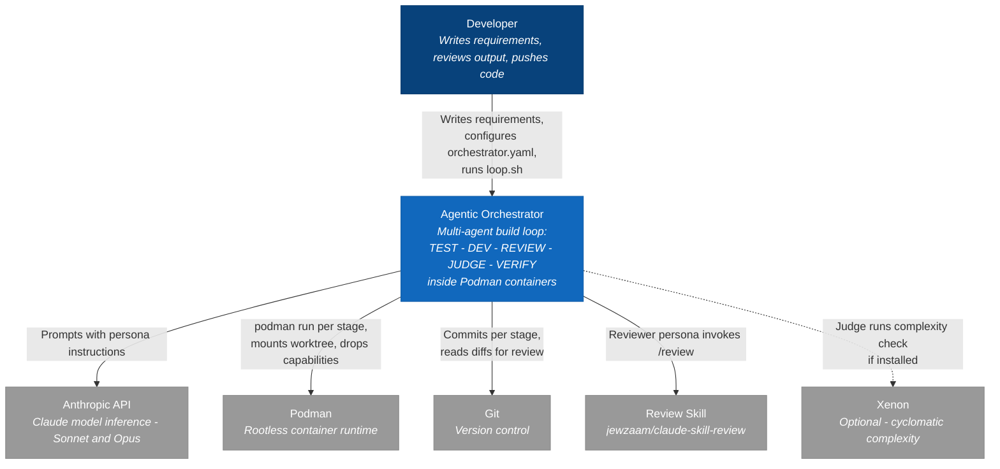

<!-- Generated By: Claude Code (Claude Opus 4.6) -->

# L1 — System Context: Agentic Orchestrator

The agentic orchestrator automates software development by running AI coding agents through
a quality-gated loop inside isolated containers. A developer provides requirements; the
system produces implemented, tested, reviewed, and judge-approved code.

## External Systems Summary

| System | Relationship | Required |
|--------|-------------|----------|
| Anthropic API | Model inference for all personas | Yes |
| Podman | Container isolation for each stage invocation | Yes |
| Git | Commits, diffs, log for traceability | Yes |
| Review Skill | 5-dimension parallel code review | Yes |
| Xenon | Cyclomatic complexity scoring | No - falls back to lines-of-code checks |

## Trust Boundary

The Podman container is the trust boundary. Each stage invocation runs in a fresh container
with `--cap-drop ALL`, `--security-opt no-new-privileges`, `--read-only`, `--pids-limit 256`,
and `--network none` by default (loop.sh overrides with `--host-network` for API access).
The container mounts exactly two volumes: the project worktree (read-write) and Claude auth
tokens (read-write). Claude Code runs with `--dangerously-skip-permissions` inside the
container because the container itself is the permission boundary.
