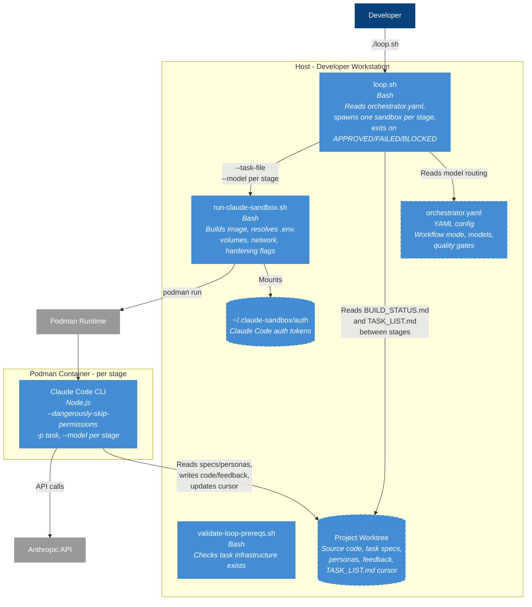

<!-- Generated By: Claude Code (Claude Opus 4.6) -->

# L2 — Container Diagram: Agentic Orchestrator

The system has no long-running services. Each stage invocation is a short-lived Podman
container running Claude Code CLI. The host runs `loop.sh` which spawns one container
at a time, sequentially.

## Concurrency Model

Strictly sequential. `loop.sh` runs one `podman run` at a time, waits for it to exit,
reads filesystem state, then decides whether to run the next stage. No parallelism
within the loop. The `</dev/null` redirect on line 73 of `loop.sh` prevents Claude Code
from reading stdin.

## State Management

All state is filesystem-based:
- `tasks/TASK_LIST.md` — cursor position (`→ NEXT:`), checkbox state, attempt counters
- `tasks/BUILD_STATUS.md` — single word: `PENDING`, `APPROVED`, or `FAILED ...`
- `tasks/feedback/` — judge verdicts, review output, verify logs
- `tasks/FEEDBACK.md` — accumulated feedback across all iterations

The loop reads `BUILD_STATUS.md` and `TASK_LIST.md` after each container exits to
determine the next action. There is no in-memory state between stages.
