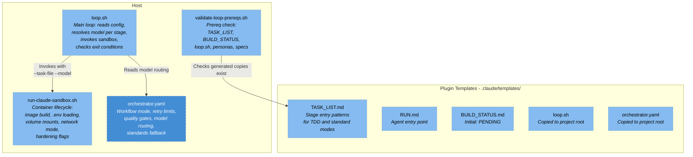
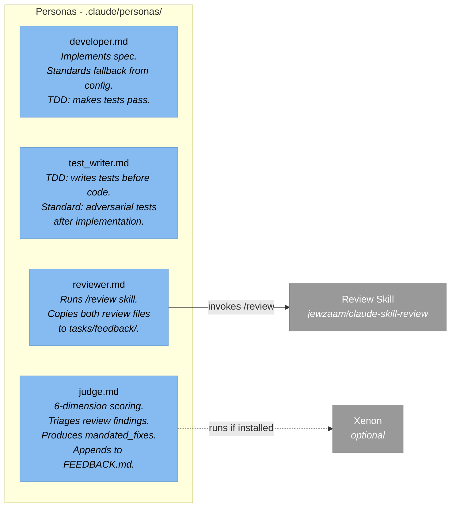
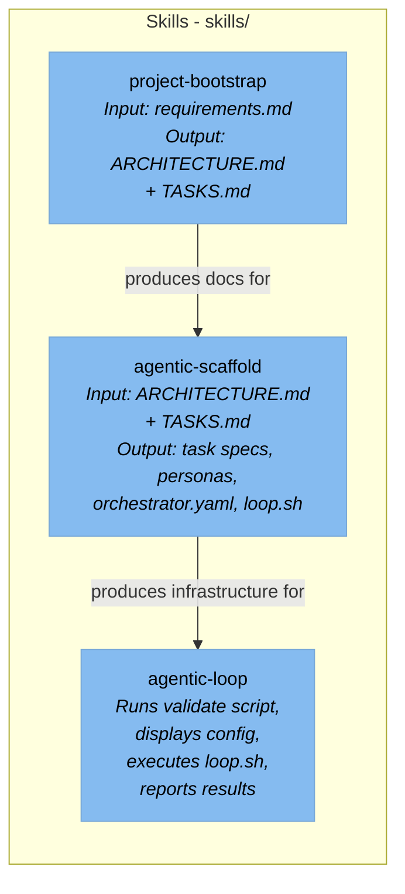

<!-- Generated By: Claude Code (Claude Opus 4.6) -->

# L3 — Component Diagram: Agentic Orchestrator

## Host Components



## Persona Components



## Skill Components



## Data Flow: Single Task Through the Loop

```
┌──────────────────────────────────────────────────────────────────────┐
│ loop.sh reads → NEXT: cursor from tasks/TASK_LIST.md                │
│ loop.sh reads orchestrator.yaml → resolves model for stage          │
│ loop.sh invokes run-claude-sandbox.sh                               │
│                        --task-file tasks/RUN.md --model {model}     │
└─────────────────────────────┬────────────────────────────────────────┘
                              │
                              ▼
┌──────────────────────────────────────────────────────────────────────┐
│ Container starts                                                     │
│ Claude reads RUN.md → reads TASK_LIST.md → finds cursor              │
│ Claude reads persona file for current stage                          │
│ Claude reads task spec from tasks/specs/task-{id}.md                 │
│                                                                      │
│ Stage work:                                                          │
│   TEST  → writes test files, commits                                 │
│   DEV   → writes implementation, commits                             │
│   REVIEW → runs /review, copies output to tasks/feedback/, commits   │
│   JUDGE  → reads diff + both review files, scores, writes verdict,   │
│            appends FEEDBACK.md, updates cursor                        │
│   VERIFY → runs test suite, writes output to tasks/feedback/          │
│                                                                      │
│ Claude updates TASK_LIST.md: checks box, advances cursor             │
│ Container exits                                                      │
└─────────────────────────────┬────────────────────────────────────────┘
                              │
                              ▼
┌──────────────────────────────────────────────────────────────────────┐
│ loop.sh reads BUILD_STATUS.md                                        │
│   APPROVED → exit 0                                                  │
│   FAILED*  → exit, print path to final-judge.md                      │
│   else     → check for [BLOCKED] in TASK_LIST.md                     │
│               [BLOCKED] found → exit, print message                  │
│               otherwise → read next cursor, loop                     │
└──────────────────────────────────────────────────────────────────────┘
```

## Event-to-State Mapping

| Event | State Change | File Modified |
|-------|-------------|---------------|
| Stage completes successfully | Checkbox `[ ]` → `[x]`, cursor advances | `tasks/TASK_LIST.md` |
| Judge returns FAIL | DEV + REVIEW unchecked, attempt counters increment, cursor resets to DEV | `tasks/TASK_LIST.md` |
| Judge returns PASS | Cursor advances to VERIFY | `tasks/TASK_LIST.md` |
| Verify tests fail | DEV + REVIEW unchecked, attempt counters increment, cursor resets to DEV | `tasks/TASK_LIST.md` |
| Attempt counter exceeds 3 | Checkbox replaced with `[BLOCKED]` | `tasks/TASK_LIST.md` |
| Final judge PASS | `BUILD_STATUS.md` overwritten with `APPROVED` | `tasks/BUILD_STATUS.md` |
| Final judge FAIL | `BUILD_STATUS.md` overwritten with `FAILED — see ...` | `tasks/BUILD_STATUS.md` |
| Judge verdict (any) | Feedback appended | `tasks/FEEDBACK.md` |
