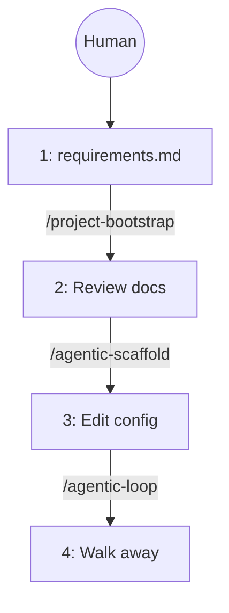
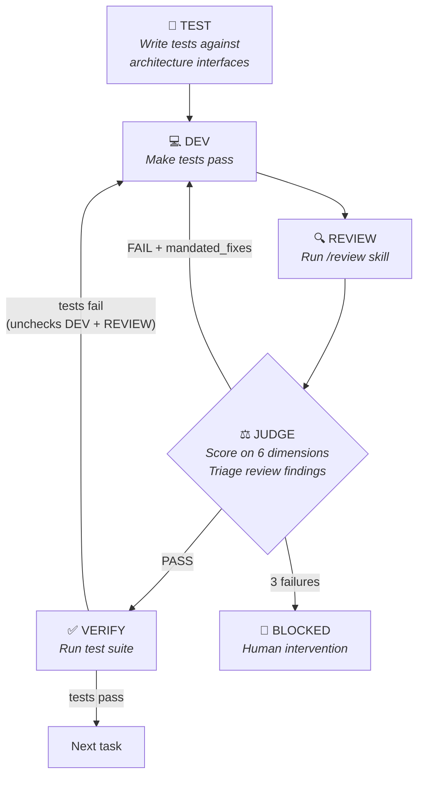
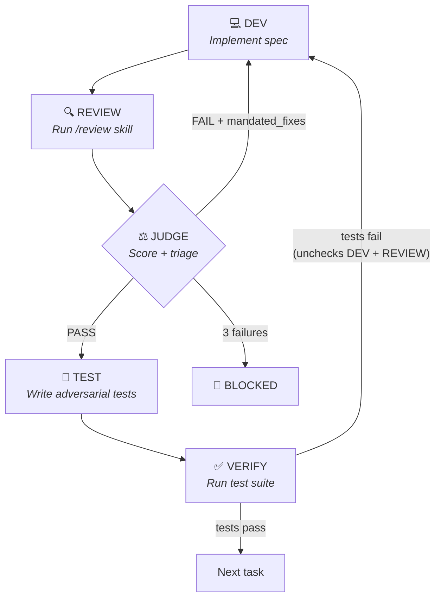
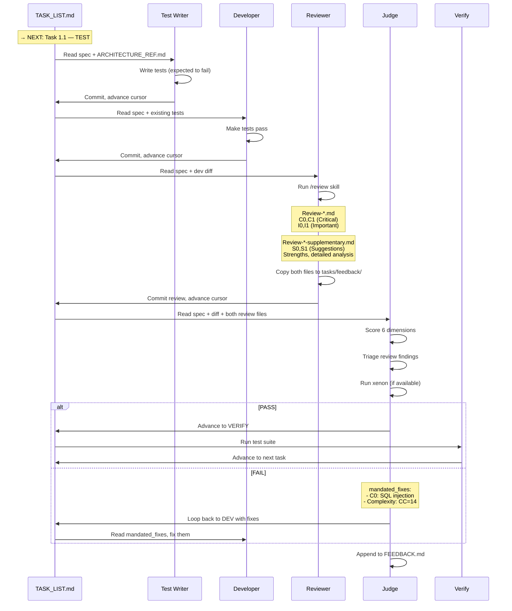
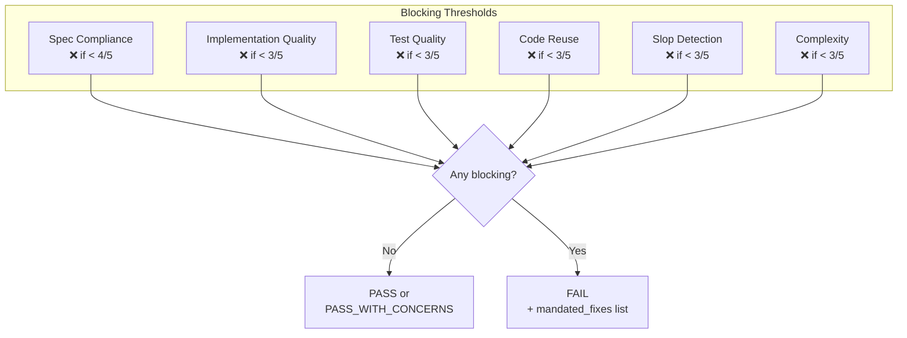
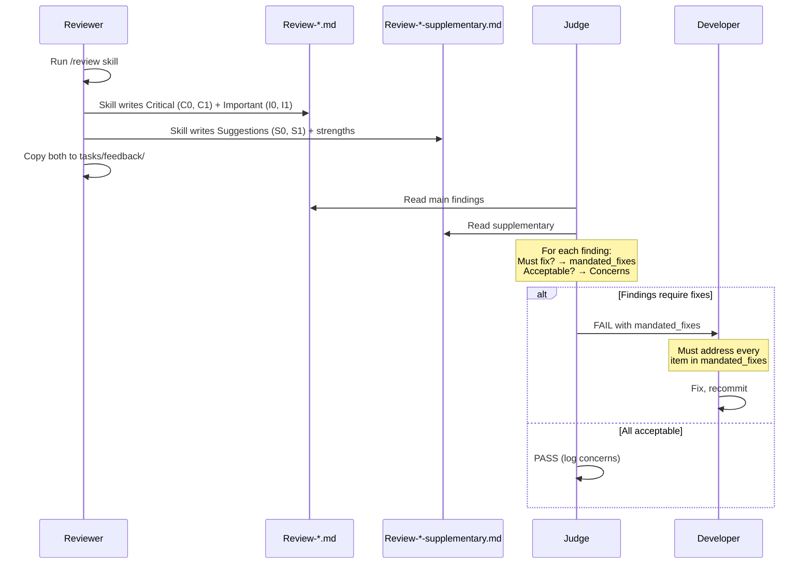
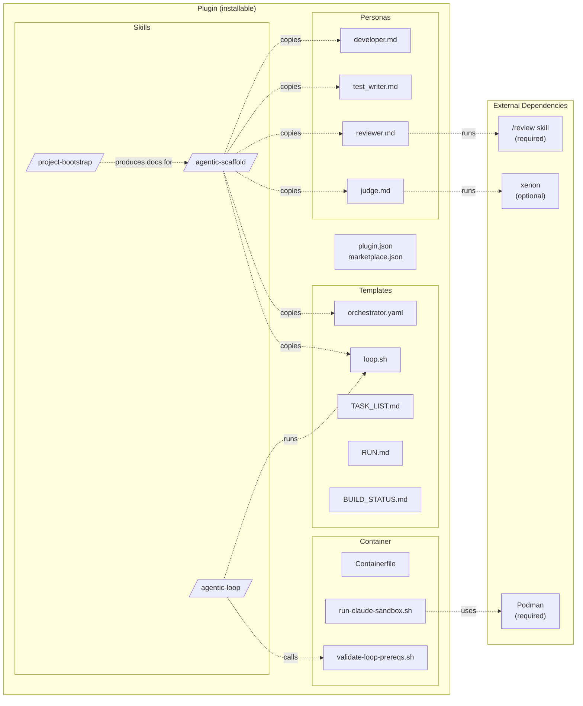
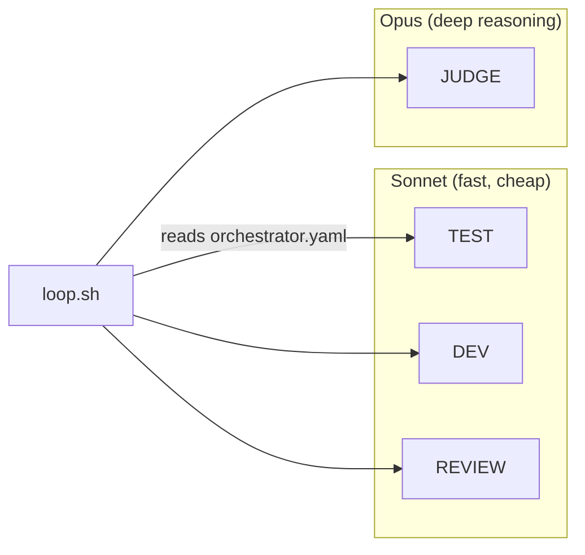
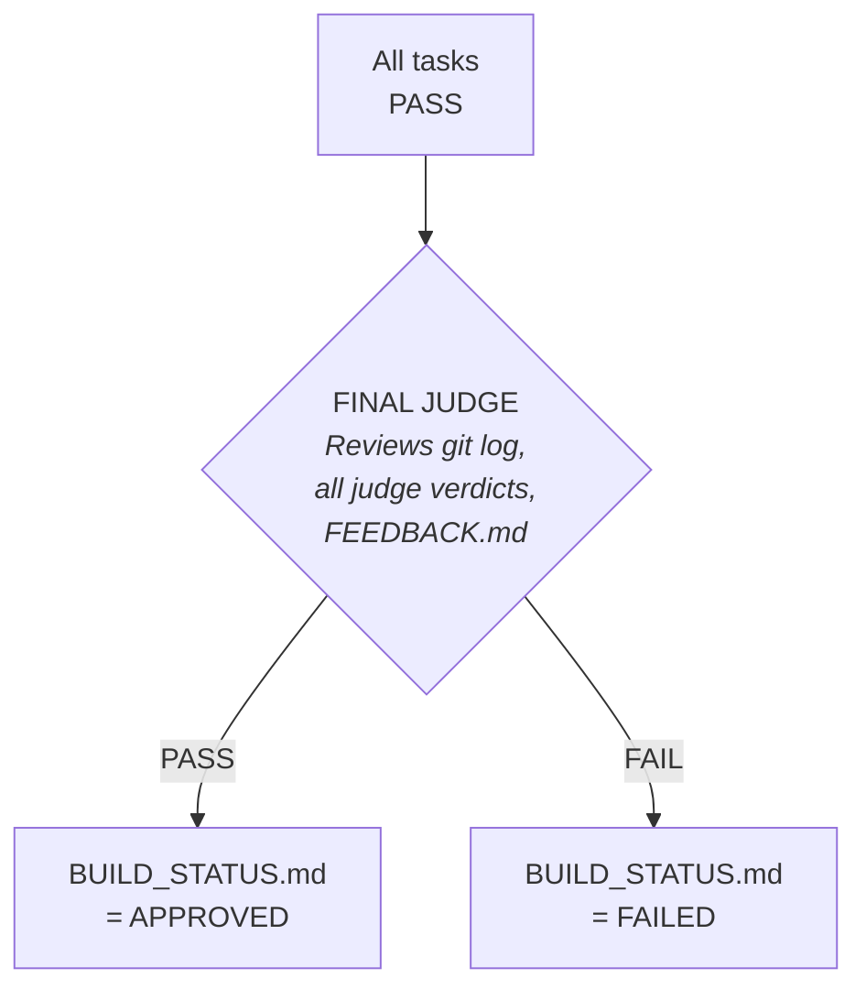
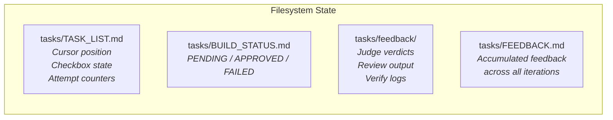

<!-- Generated By: Claude Code (Claude Opus 4.6) -->

# How It Works

## The Big Picture

You do four things. The agents do everything else.

### Step 1: Have requirements

Get a `docs/requirements.md` into your project. This could come from anywhere — write it
yourself, generate it from a brainstorming skill, pull it from a spec-kit session, or
paste in notes from a conversation. The format doesn't matter as long as it describes
what you want built.

### Step 2: Generate architecture and tasks

Run `/project-bootstrap` (or `/project-bootstrap docs/requirements.md` if the file is
somewhere else). This produces `docs/ARCHITECTURE.md` (tech stack, data models, API
design, deployment) and `docs/TASKS.md` (ordered task breakdown with acceptance criteria).
**Review both files and make corrections before proceeding** — everything downstream
builds on these.

### Step 3: Scaffold the workflow

Run `/agentic-scaffold docs/TASKS.md docs/ARCHITECTURE.md`. This generates task specs,
copies personas, creates `orchestrator.yaml` and `loop.sh`. Optionally edit
`orchestrator.yaml` to change workflow mode, model routing, or quality gates.

### Step 4: Run the loop and walk away

Run `/agentic-loop`. It validates prerequisites, then runs `loop.sh` unattended until
all tasks are approved or one gets blocked. When it finishes, review the git history
and push.

## Workflow Modes

The build loop supports two modes, controlled by `orchestrator.yaml`:

### TDD Mode (default)

Tests are written first. The developer's job is to make them pass.

### Standard Mode

Developer writes code first, tests come after the judge approves.

## What Each Persona Does

## Judge Scoring

The judge scores every task on 6 dimensions:

## Review → Judge → Fix Flow

The reviewer finds issues. The judge decides which must be fixed.

## Plugin Component Map

## Model Routing

Each stage uses the model best suited to its task, configured in `orchestrator.yaml`:

Override all stages with `./loop.sh --model sonnet`.

## Final Judge

After all tasks pass, a separate FINAL JUDGE reviews the entire project — not a single task.

The final judge looks for systemic issues per-task judges may have missed: inconsistent
patterns across phases, unresolved concerns from multiple `pass_with_concerns` verdicts,
and review quality trends.

## State Model

All state lives in the filesystem. There is no in-memory persistence between containers.
Each stage runs in a fresh Podman container that reads state, does work, writes state, and
exits. `loop.sh` on the host reads the updated state to decide what to do next.

## Container Isolation

Each stage runs inside a hardened Podman container. The container is the security boundary.

| Control | Setting |
|---------|---------|
| Capabilities | `--cap-drop ALL` |
| Privilege escalation | `--security-opt no-new-privileges` |
| Processes | `--pids-limit 256` |
| Network | `--network none` default; `loop.sh` passes `--host-network` for API access |
| Volumes | Worktree (rw) + auth tokens (rw) only |
| Container lifecycle | `--rm` (ephemeral, no state persists in the container) |

### Why no `--read-only` filesystem?

The original design used `--read-only` with targeted `--tmpfs` mounts for directories
Claude Code needs to write to (`/tmp`, `/home/node/.config`, `/home/node/.local`). This
worked on Linux but failed on Windows (Podman for Windows) due to two issues:

1. **Claude Code writes to unpredictable locations.** Beyond the expected XDG directories,
   it writes `/home/node/.claude.json` directly in the home directory, and future versions
   may add more. Maintaining a whitelist of tmpfs mounts is fragile.
2. **Podman on Windows doesn't support `uid`/`gid` tmpfs options.** Without these, tmpfs
   mounts are root-owned and the `node` user (uid 1000) gets `EACCES` errors. The `mode`
   option is also unsupported.

Rather than maintaining platform-specific isolation logic, `--read-only` was removed
entirely. The remaining controls are sufficient:

- **Volume mounts** are the real isolation boundary — only the worktree and auth directory
  are accessible from the host. Writes to the container's root filesystem cannot reach the
  host.
- **`--cap-drop ALL`** prevents privileged operations (mounting filesystems, changing
  ownership of root-owned files, binding privileged ports).
- **`--rm`** makes the container ephemeral — any modifications to the root filesystem
  (e.g., a compromised process replacing system binaries) vanish when the container exits.
- **`--security-opt no-new-privileges`** prevents setuid escalation.

The `--read-only` flag was defense-in-depth against in-session persistence attacks, which
are already mitigated by ephemeral containers.

## Known Limitations

- **No stuck-state detection.** If a container exits without changing `TASK_LIST.md` state
  (API outage, container crash), the loop re-runs the same stage indefinitely. There is no
  iteration counter or timeout in `loop.sh`.
- **Tracing not yet implemented.** `orchestrator.yaml` has a `tracing.enabled` field but
  no code reads it.
